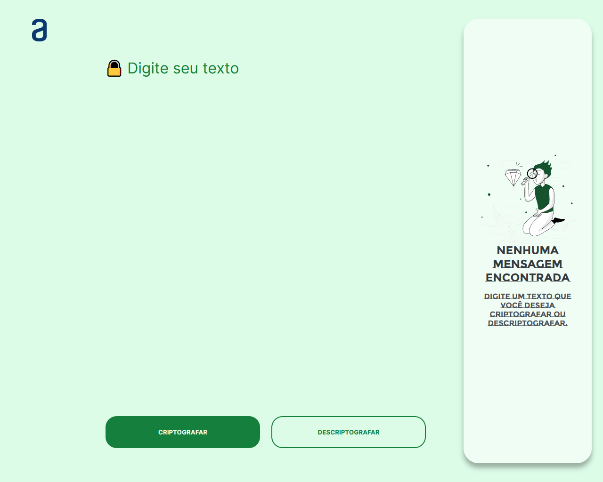

# Decodificador de texto

Aplicação que criptografa textos, assim você poderá trocar mensagens secretas com outras pessoas que saibam o segredo da criptografia utilizada.

- Tecnologias utilizadas: HTML, CSS e JavaScript.

## Índice

- [Visão Geral](#visao-geral)
  - [Links](#links)
  - [Como rodar o projeto](#como-rodar-o-projeto)
- [Autor](#autor)

## Visao Geral

As "chaves" de criptografia que utilizaremos são:
A letra "e" é convertida para "enter"
A letra "i" é convertida para "imes"
A letra "a" é convertida para "ai"
A letra "o" é convertida para "ober"
A letra "u" é convertida para "ufat"

Requisitos:
- Deve funcionar apenas com letras minúsculas
- Não devem ser utilizados letras com acentos nem caracteres especiais
- Deve ser possível converter uma palavra para a versão criptografada e também retornar uma palavra criptografada para a versão original.

Por exemplo:
"gato" => "gaitober"
gaitober" => "gato"

 - A página deve ter campos para inserção do texto a ser criptografado ou descriptografado, e a pessoa usuária deve poder escolher entre as duas opções
 - O resultado deve ser exibido na tela.

Extras:
- Um botão que copie o texto criptografado/descriptografado para a área de transferência - ou seja, que tenha a mesma funcionalidade do ctrl+C ou da opção "copiar" do menu dos aplicativos.

### Links

- URL do repositório: [Código](https://github.com/thiagoa-martins/decodificador-de-texto)

### Como rodar o projeto

- Acesse a URL do projeto.

## Autor

- Github - [thiagoa-martins](https://github.com/thiagoa-martins)
- Linkedin - [thiagoa-martins](https://www.linkedin.com/in/thiagoa-martins/)
